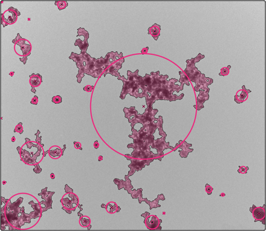

  

(***Py***thon ***A***nalysis tools for **_TEM_** images of ***S***oot)

---

A python codebase to analyze TEM images of soot, which includes new methods associated with this project and a compilation of other pre-existing methods into a single Python package. The original implementation was a port of previous MATLAB code (https://github.com/tsipkens/atems), which was described by [Sipkens et al. (2023)][joss24].

  

---

### License

This software is released under a GNU GENERAL PUBLIC LICENSE license (see the corresponding license file for details).

### Contributors and acknowledgements

Direct contributors include [Timothy Sipkens](https://github.com/Hamed-NKR), [Hamed Nikookar](https://github.com/Hamed-NKR), [Max Frei](https://github.com/maxfrei750), and [Ethan Xiong](https://github.com/etxthelegend). Pieces of this code were adapted from various sources and features snippets written by several individuals, including [Darwin Zhu](https://github.com/darwinz7), [Ramin Dastanpour](https://github.com/rdastanpour), [Una Trivanovic](https://github.com/unatriva), Alberto Baldelli, Yiling Kang, Yeshun (Samuel) Ma, and Steven Rogak.

This program contains very significantly modified versions of the code distributed with [Dastanpour et al. (2016)][dastanpour2016]. The most recent version of the Dastanpour et al. code prior to this overhaul is available at https://github.com/unatriva/UBC-PCM (which itself presents a minor update from the original). That code forms the basis for some of the methods underlying the manual processing and the PCM method used in this code, as noted in the README above. However, significant optimizations have improved code legibility, performance, and maintainability (e.g., the code no longer uses global variables).

A snapshot of the dm3_lib (https://github.com/nanobore/dm3) for reading in DM3 files is included in this program, and represents a Python adaptation of an original ImageJ plugin by Greg Jefferis.

The following analysis methods were adapted for inclusion here or have accompanying repositories elsewhere:

**hough_kook\***. Corresponds to a Pythong translation of the MATLAB code of [Kook et al. (2015)][kook]. Code was also modified to accommodate the expected inputs and outputs common to the other functions.

**edm_sbs**. This code also contain an adaptation of the EDM-SBS method of [Bescond et al. (2014)][bescond]. We thank the authors, in particular Jérôme Yon, for their help in understanding their original [Scilab code and ImageJ plugin](https://www.coria.fr/en/edm-sbs-automated-analysis-of-tem-images/). Modifications to allow the method to work directly on binary images (rather than a custom output from ImageJ) and to integrate the method into the MATLAB environment may present some minor compatibility issues, but allows use of the aggregate segmentation methods given in the **agg** package.

**carboseg**. This method is a CNN-based segmentation method associated with [Sipkens et al. (2021)][ptech.cnn]. The corresponding ONNX file is available **[here](https://github.com/maxfrei750/CarbonBlackSegmentation/releases/download/v1.0/FPN-resnet50-imagenet.onnx)**. See the [CarbonBlackSegmentation](https://github.com/maxfrei750/CarbonBlackSegmentation) repository for information on training.

### How to cite

When using this code, please cite:

> [Sipkens et al., (2024). atems: Analysis tools for TEM images of carbonaceous particles. _Journal of Open Source Software_, **9**(99) 6416.][joss24]

Codes should also acknowledge the corresponding studies for the original methods listed under the acknowledgements above. When using the _k_-means segmentation procedure, please cite:

> [Sipkens, T. A., Rogak, S. N. (2021). Technical note: Using k-means to identify soot aggregates in transmission electron microscopy images. Journal of Aerosol Science, 105699.][jaskmeans]

### References

[Bescond, A., Yon, J., Ouf, F. X., Ferry, D., Delhaye, D., Gaffié, D., Coppalle, A. & Rozé, C. (2014). Automated determination of aggregate primary particle size distribution by TEM image analysis: application to soot. Aerosol Science and Technology, **48**(8) 831-841.][bescond]

[Dastanpour, R., Boone, J. M., & Rogak, S. N. (2016). Automated primary particle sizing of nanoparticle aggregates by TEM image analysis. Powder Technology, **295** 218-224.][dastanpour2016]

[Dastanpour, R., & Rogak, S. N. (2014). Observations of a correlation between primary particle and aggregate size for soot particles. Aerosol Science and Technology, **48**(10) 1043-1049.][dastanpour2014]

[Kheirkhah, P., Baldelli, A., Kirchen, P. & Rogak, S., (2020). Development and validation of a multi-angle light scattering method for fast engine soot mass and size measurements. Aerosol Science and Technology, **54**(9), 1083-1101.][kheirkhah20]

[Kook, S., Zhang, R., Chan, Q. N., Aizawa, T., Kondo, K., Pickett, L. M., Cenker, E., Bruneaux, G., Andersson, O., Pagels, J., & Nordin, E. Z. (2016). Automated detection of primary particles from transmission electron microscope (TEM) images of soot aggregates in diesel engine environments. _SAE International Journal of Engines_, **9**(1) 279-296.][kook]

[Sipkens, T. A., Zhou., L., Rogak, S. N. (2020). Aggregate-level segmentation of soot TEM images by unsupervised machine learning. _European Aerosol Conference_, Aachen, Germany.][eac20]

[Sipkens, T. A., Rogak, S. N. (2021). Technical note: Using k-means to identify soot aggregates in transmission electron microscopy images. _Journal of Aerosol Science_, 105699.][jaskmeans]

[Sipkens, T. A., Dastanpour, R., Trivanovic, U., Nikookar, H., Rogak, S. N. (2024). atems: Analysis tools for TEM images of carbonaceous particles. _Journal of Open Source Software_, **9**(99) 6416.][joss24]

[Sipkens, T.A., Frei, M., Baldelli, A., Kirchen, P., Kruis, F. E., & Rogak, S. N. (2021) Characterizing soot in TEM images using a convolutional neural network. Powder Technology.][ptech.cnn]

[Trivanovic, U., Sipkens, T. A., Kazemimanesh, M., Baldelli, A., Jefferson, A. M., Conrad, B. M., Johnson, M. R., Corbin, J. C., Olfert, J. S., & Rogak, S. N. (2020). Morphology and size of soot from gas flares as a function of fuel and water addition. _Fuel_, **279** 118478.][triv20]

[kook]: https://doi.org/10.4271/2015-01-1991
[dastanpour2016]: https://doi.org/10.1016/j.powtec.2016.03.027
[dastanpour2014]: https://doi.org/10.1080/02786826.2014.955565
[bescond]: https://doi.org/10.1080/02786826.2014.932896
[triv20]: https://doi.org/10.1016/j.fuel.2020.118478
[eac20]: https://doi.org/10.13140/RG.2.2.14433.12648
[jaskmeans]: https://doi.org/10.1016/j.jaerosci.2020.105699
[kheirkhah20]: https://doi.org/10.1080/02786826.2020.1758623
[ptech.cnn]: https://doi.org/10.1016/j.powtec.2021.04.026
[joss24]: https://doi.org/10.21105/joss.06416
